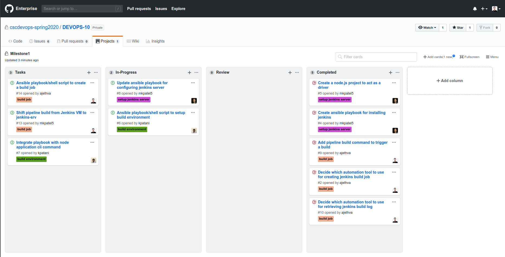

# Checkpoint 1
## Planning
We planned on how to achieve the objective of this milestone and divided the tasks amongst ourselves by creating different stories on GitHub Project Board for this [milestone](https://github.ncsu.edu/cscdevops-spring2020/DEVOPS-10/projects/1). Each story is created such that it can be performed independently.

## Goals Achieved
We created skeleton for our node project from [CM-Template](https://github.com/CSC-DevOps/CM-Template). After that we implemented `pipeline setup` command which currently issues jenkins-srv VM with specific [ip-address](https://github.com/CSC-DevOps/Course/blob/master/Project/Pipeline1.md#constraints) and installed ansible in it to install other dependencies like Java, Jenkins, etc in it using an ansible playbook. We will be using this playbook for automating remaining tasks in the future.

Also, we implemented `pipeline build <buildJobName>` command which triggers a build job (named buildJobName), waits for output, and prints build log. For this we followed [Jenkins Workshop](https://github.com/CSC-DevOps/Jenkins) repository. But currently it runs the build job on the jenkins VM created in the workshop.

| Task | Issue |
| ------ | ------ |
| Create a node.js project to act as a driver | [Issue #5](https://github.ncsu.edu/cscdevops-spring2020/DEVOPS-10/issues/5) |
| Create ansible playbook for installing jenkins | [Issues #4](https://github.ncsu.edu/cscdevops-spring2020/DEVOPS-10/issues/4) |
| Decide which automation tool to use for creating jenkins build job | [Issues #2](https://github.ncsu.edu/cscdevops-spring2020/DEVOPS-10/issues/2) |
| Decide which automation tool to use for retrieving jenkins build log | [Issues #10](https://github.ncsu.edu/cscdevops-spring2020/DEVOPS-10/issues/10) |
| Add pipeline build command to trigger a build | [Issues #9](https://github.ncsu.edu/cscdevops-spring2020/DEVOPS-10/issues/9) |

## Future Work
| Task | Issue |
| ------ | ------ |
| Update ansible playbook  for configuring jenkins server  | [Issues #8](https://github.ncsu.edu/cscdevops-spring2020/DEVOPS-10/issues/8) |
| Ansible playbook/shell script to setup build environment | [Issues #6](https://github.ncsu.edu/cscdevops-spring2020/DEVOPS-10/issues/6) |
| Ansible playbook/shell script to create a build job | [Issues #14](https://github.ncsu.edu/cscdevops-spring2020/DEVOPS-10/issues/14) |
| Shift pipeline build from jenkins (workshop) VM to jenkins-srv | [Issues #13](https://github.ncsu.edu/cscdevops-spring2020/DEVOPS-10/issues/13) |
| Integrate playbook with node application cli command | [Issues #7](https://github.ncsu.edu/cscdevops-spring2020/DEVOPS-10/issues/7) |

## Current Snapshot of the Project Board:

