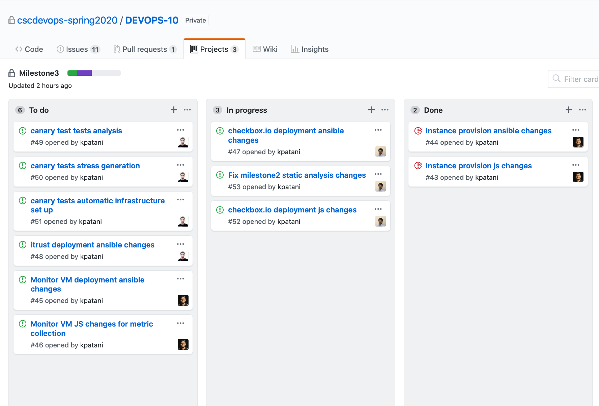

# Checkpoint 1
## Planning
We had a planning session on how to goforth with this milestone, and discussed the monitoring and canary part in detail. We again divided the tasks amongst us and made sure we keep them independent of other tasks on our Github Project [deploy](https://github.ncsu.edu/cscdevops-spring2020/DEVOPS-10/projects/3).

## Goals Achieved
We have implemented the `pipeline prod up` command to provision instances on AWS using ansible. We are also working on feedback from Miletstone 2 and on our way to implement `pipeline deploy` command and canary tests.

| Task | Issue |
| ------ | ------ |
| Instance provision js changes | [Issue #43](https://github.ncsu.edu/cscdevops-spring2020/DEVOPS-10/issues/43) |
| Instance provision ansible changes | [Issue #44](https://github.ncsu.edu/cscdevops-spring2020/DEVOPS-10/issues/44) |

## Future Work
| Task | Issue |
| ------ | ------ |
| Monitor VM JS changes for metric collection | [Issue #46](https://github.ncsu.edu/cscdevops-spring2020/DEVOPS-10/issues/46) |
| Monitor VM deployment ansible changes | [Issue #45](https://github.ncsu.edu/cscdevops-spring2020/DEVOPS-10/issues/45) |
| Checkbox.io deployment ansible changes | [Issue #47](https://github.ncsu.edu/cscdevops-spring2020/DEVOPS-10/issues/47) |
| itrust deployment ansible changes | [Issue #48](https://github.ncsu.edu/cscdevops-spring2020/DEVOPS-10/issues/48) |
| Canary tests automatic infrastructure set up | [Issue #51](https://github.ncsu.edu/cscdevops-spring2020/DEVOPS-10/issues/51) |
| Canary tests stress generation | [Issue #50](https://github.ncsu.edu/cscdevops-spring2020/DEVOPS-10/issues/50) |
| Canary test tests analysis | [Issue #49](https://github.ncsu.edu/cscdevops-spring2020/DEVOPS-10/issues/49) |

## Current Snapshot of the Project Board[To be implmedted]:

