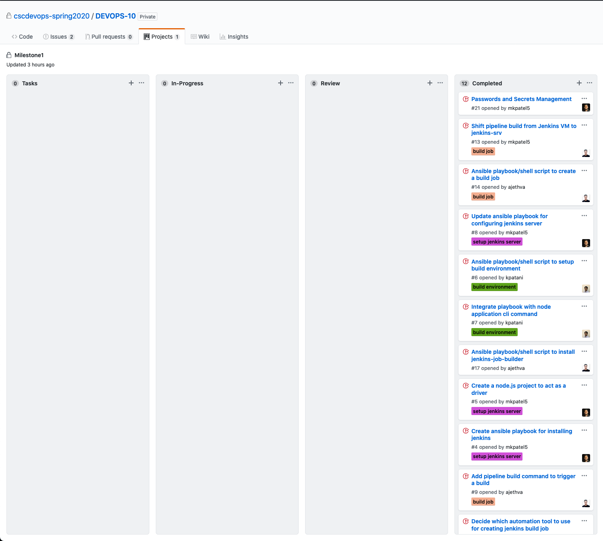

# Deploy Milestone

## Discussions
In this milestone, we sat & discussed all the ways we could achieve the goal and divide the tasks amongst ourselves in such a way that nobody gets overwhelmed. To get everyone to work at their own speed, we decided that each member would be performing one task. The tag was decided on the basis of a particular story's major task i.e. `pipeline prod up`, `deploy`, `canary analysis`. Further, we focussed on inter-tasks dependability. Since each member was responsible for one task, we began to accord our tasks. For example, Maharsh was given the task to setup production and monitoring servers. Ketul was given the task to deploy checkbox.io and iTrust. They sat down together and merged their code and remove any turbulence between their codes. Anshul was given task implement netflix style red-black deployment with canary analysis of a microservice.

## Implementation
1. `pipeline prod up`  
This command helps to create production servers on AWS named (monitor, iTrust and checkbox.io) and deploy monitoring service.

2. `pipeline deploy checkbox.io -i inventory.i`  
This commands helps us to deploy checkbox.io on AWS EC2 instance

3. `pipeline deploy iTrust -i inventory.ini`
This commands helps us to deploy iTrust on AWS EC2 instance

4. `pipeline canary master broken`
This commands helps us to construct canary infrastructure, collect data, and perform analysis on the given branches.

### Dependencies:
- Ansible
- Jenkins
- MongoDB
- NodeJS
- MySQL
- iTrust
- checkbox.io
- AWS

## Credentials Management
In order to protect credentials, they're are managed using :
- Ansible Vault
- Config files

## Tasks

| Task | Issue |
| ------ | ------ |
| Instance provision ansible changes | [Issue #44](https://github.ncsu.edu/cscdevops-spring2020/DEVOPS-10/issues/44) |
| Instance provision js changes | [Issue #43](https://github.ncsu.edu/cscdevops-spring2020/DEVOPS-10/issues/43) |
| Monitor VM deployment ansible changes | [Issue #45](https://github.ncsu.edu/cscdevops-spring2020/DEVOPS-10/issues/45) |
| canary tests automatic infrastructure set up | [Issue #51](https://github.ncsu.edu/cscdevops-spring2020/DEVOPS-10/issues/51) |
| checkbox.io deployment js changes | [Issue #52](https://github.ncsu.edu/cscdevops-spring2020/DEVOPS-10/issues/52) |
| Fix milestone2 static analysis changes | [Issue #53](https://github.ncsu.edu/cscdevops-spring2020/DEVOPS-10/issues/53) |
| checkbox.io deployment ansible changes | [Issue #47](https://github.ncsu.edu/cscdevops-spring2020/DEVOPS-10/issues/47) |
| canary tests compare health metrics | [Issue #50](https://github.ncsu.edu/cscdevops-spring2020/DEVOPS-10/issues/50) |
| canary test generate health metrics | [Issue #49](https://github.ncsu.edu/cscdevops-spring2020/DEVOPS-10/issues/49) |
| itrust deployment ansible changes | [Issue #48](https://github.ncsu.edu/cscdevops-spring2020/DEVOPS-10/issues/48) |
| Monitor VM JS changes for metric collection | [Issue #46](https://github.ncsu.edu/cscdevops-spring2020/DEVOPS-10/issues/46) |
## Current Snapshot of the Project Board:

## Screencast
[Screencast Video](https://drive.google.com/open?id=1fCF1fJTuE-TnvXc0Pq80S0OMo9cfMXGD)
