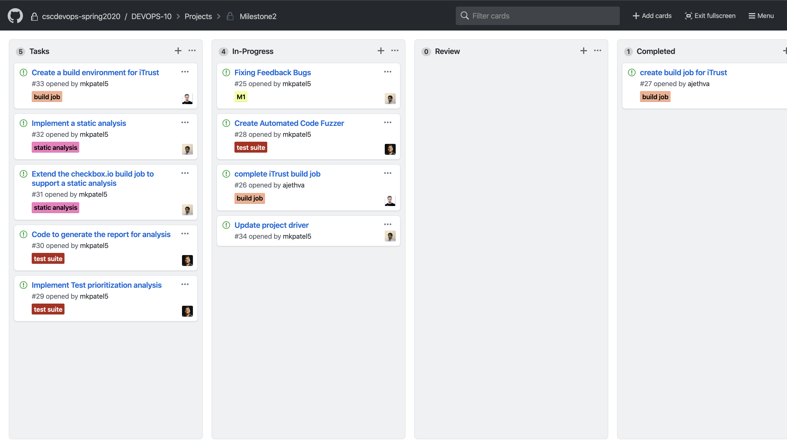

# Checkpoint 1
## Planning
We planned on how to achieve the objective of this milestone and divided the tasks amongst ourselves by creating different stories on GitHub Project Board for this [milestone](https://github.ncsu.edu/cscdevops-spring2020/DEVOPS-10/projects/2). Each story is created such that it can be performed independently.

## Goals Achieved
We have created the build job for iTrust using Ansible which currently clones the GitHub repo(Manually created GH_USER and GH_PASS). We are also working on feedback from Milestone 1. We have also started working on creating automated code fuzzer.

| Task | Issue |
| ------ | ------ |
| Create build job for iTrust | [Issue #27](https://github.ncsu.edu/cscdevops-spring2020/DEVOPS-10/Issue/27) |

## Future Work
| Task | Issue |
| ------ | ------ |
| Fixing Feedback Bugs | [Issue #25](https://github.ncsu.edu/cscdevops-spring2020/DEVOPS-10/Issue/25) |
| Create Automated Code Fuzzer | [Issue #28](https://github.ncsu.edu/cscdevops-spring2020/DEVOPS-10/Issue/28) |
| Implement Test prioritization analysis | [Issue #29](https://github.ncsu.edu/cscdevops-spring2020/DEVOPS-10/Issue/29) |
| Code to generate the report for analysis | [Issue #30](https://github.ncsu.edu/cscdevops-spring2020/DEVOPS-10/Issue/30) |
| Implement a static analysis | [Issue #32](https://github.ncsu.edu/cscdevops-spring2020/DEVOPS-10/Issue/32) |
| Extend the checkbox.io build job to support a static analysis | [Issue #31](https://github.ncsu.edu/cscdevops-spring2020/DEVOPS-10/Issue/31) |
| Create a build environment for iTrust | [Issue #33](https://github.ncsu.edu/cscdevops-spring2020/DEVOPS-10/Issue/33) |
| Update project driver | [Issue #34](https://github.ncsu.edu/cscdevops-spring2020/DEVOPS-10/Issue/34) |
| Complete iTrust build job | [Issue #26](https://github.ncsu.edu/cscdevops-spring2020/DEVOPS-10/Issue/26) |

## Current Snapshot of the Project Board:

