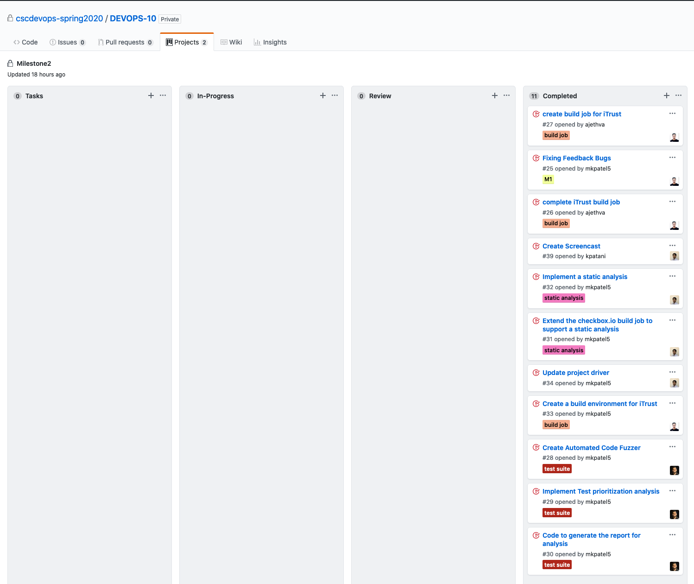

# Test Milestone

## Discussions
In this milestone, we discussed on how to iterate over already exsiting code base. We split our work into two parts, one, commands which needed additional functionality such as ```pipeline setup --gh-user <username> --gh-pass <password>```and second commands which needed a separate functionaly such as ```pipeline useful-tests -c 100```. Further, we majorly on splittig the task such that no one is overwhelmed or cause any inter task dependability which could hinder a team member. Since the code base was increasing and getting complex, we started reviewing each other pull request thoroughly and maintained a SDLC ethics. Due to current situations, we couldn't meet daily so we used to have bug session over video calls and try to solve problem together remotely.

## Implementation
1. `pipeline setup --gh-user <username> --gh-pass <password>`  
This command helps to create a VM using bakerx CLI utility and installs Jenkins contingious integration server on it. This commands also create a pipeline and job to build and test ```checkbox.io``` recent changes. Moreover it also creates a pipeline and job for ```iTrust```.

2. `pipeline build iTrust`  
This command helps to trigger pipeline in Jenkins server to build and analyse the recent changes made to ```iTrust``` development repository.

3. `pipeline useful-tests -c 100`  
This command runs 100 fuzzy test on ```iTrust``` to detect useful tests by randomly  
    - swapping "==" with "!="
    - changing content of "strings" in code.
    - swapping 0 with 1 
    - swapping "<" with ">"
and produces a test report for the same.

4. `pipeline build checkbox.io`  
It triggers a build pipeline for ```checkbox.io``` but with an additional static analysis of the code to check if any code smells are detected. Following are the code smells:  
    - Long Method containg more than 100 lines of code
    - Message chains exceeding 10 (Eg. ```x().y().z().a().b().c().d()```)
    - Number of ```if``` conditions in a methos exceeding 5
If any code smell is detected, then build fails citing the file and method name.

### Dependencies:
- Ansible
- Jenkins
- MongoDB
- NodeJS
- iTrust

## Credentials Management
In order to protect credentials, they're are managed using :
- Ansible Vault
- Config files

## Tasks

| Task | Issue |
| ------ | ------ |
| Create build job for iTrust | [Issue #27](https://github.ncsu.edu/cscdevops-spring2020/DEVOPS-10/issues/27) |
| Fixing Feedback bugs | [Issue #25](https://github.ncsu.edu/cscdevops-spring2020/DEVOPS-10/Issue/25) |
| Create a build environment for iTrust | [Issue #33](https://github.ncsu.edu/cscdevops-spring2020/DEVOPS-10/Issue/33) |
| Update project driver | [Issue #34](https://github.ncsu.edu/cscdevops-spring2020/DEVOPS-10/Issue/34) |
| Extend the checkbox.io build job to support a static analysis | [Issue #31](https://github.ncsu.edu/cscdevops-spring2020/DEVOPS-10/Issue/31) |
| Implement a static analysis  | [Issue #32](https://github.ncsu.edu/cscdevops-spring2020/DEVOPS-10/Issue/32) |
| Create Automated Code Fuzzer | [Issue #28](https://github.ncsu.edu/cscdevops-spring2020/DEVOPS-10/Issue/28) |
| Code to generate the report for analysis | [Issue #30](https://github.ncsu.edu/cscdevops-spring2020/DEVOPS-10/Issue/30) |
| Implement Test prioritization analysis  | [Issue #29](https://github.ncsu.edu/cscdevops-spring2020/DEVOPS-10/Issue/29) |

## Current Snapshot of the Project Board:



## Screencast(Remaining)
[Screencast Video](https://drive.google.com/open?id=1fCF1fJTuE-TnvXc0Pq80S0OMo9cfMXGD)